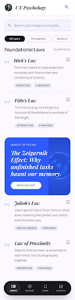
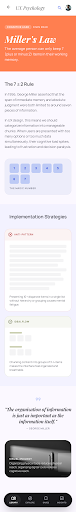
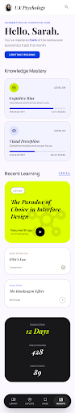

# UX Psychology

A SwiftUI app for learning UX psychology principles — laws, cognitive patterns, and design heuristics.

## Screens

| Library & Search | Law Detail — Miller's Law | Profile & Mastery |
|:---:|:---:|:---:|
|  |  |  |

## Features

- **Library** — Browse foundational UX laws with search and category filters
- **Law Detail** — Deep-dive articles with visual examples and implementation strategies
- **Profile & Mastery** — Track learning progress across knowledge domains

## Stack

- SwiftUI
- iOS 17+
- Async image loading
- Custom design system (Playfair Display + Manrope, Material Design 3 color tokens)
